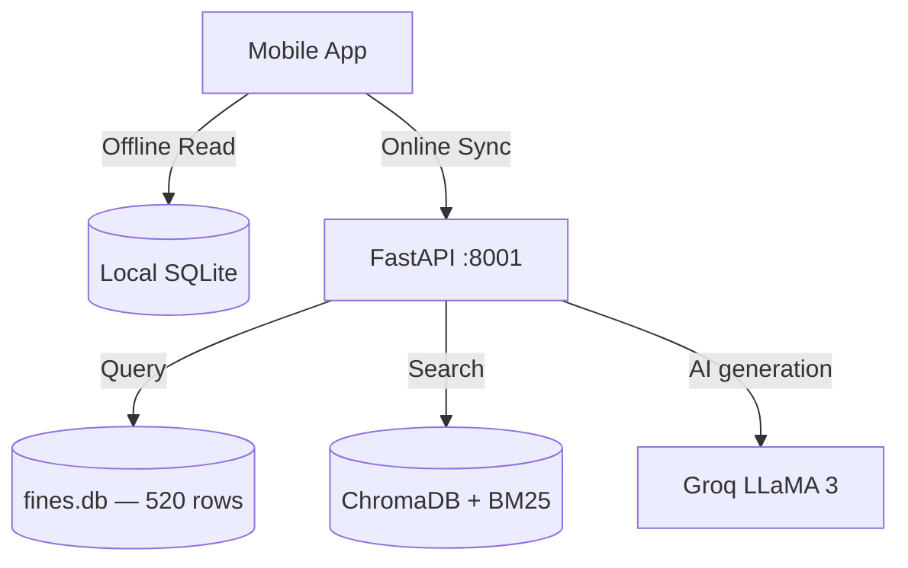

# DriveLegal

[](https://expo.dev/)
[](https://fastapi.tiangolo.com/)
[](https://www.typescriptlang.org/)
[](https://www.sqlite.org/)
[](https://github.com/)
[](https://github.com/)

**DriveLegal** is an offline-first, AI-powered mobile legal companion for drivers. It puts the complete traffic fine schedule for India, UAE, Singapore, and the UK in your pocket — with an AI chatbot that cites exact Motor Vehicles Act sections, a multi-violation challan calculator, and real-time geofencing alerts. Everything works without internet.

> Built for the **IIT Madras Road Safety Hackathon 2026**.

## 📊 Data Infrastructure Summary

```text
DriveLegal Data Infrastructure
━━━━━━━━━━━━━━━━━━━━━━━━━━━━━
Total Files:         3,527
Total Data Volume:   ~1.16 GB
RAG Documents:       12,050 (InLegalBERT indexed)
Fine Records:        216 (IN/AE/SG/GB)
Geofencing Zones:    102 (TN, DL, MH + national)
States Covered:      18 (India) + 3 international
Languages Supported: 6 (EN, HI, TA, TE, KN, MR)
Kaggle Datasets:     5 integrated
Court Judgements:    50+ cases
Legal Sections:      MV Act 1988 + 5 State Acts
```

## CV Module — Dataset Registry & Scaffolding

The following Kaggle datasets are registered in `dataset_catalog.json` 
with MD5 checksums, schema definitions, and ingestion pipelines ready. 
Raw image data is excluded from the repository (total ~4.2 GB) per 
standard ML project practice.

| Dataset | Records | Status |
|---|---|---|
| Indian Traffic Signs | ~5,000 images | Pipeline ready, model pending training |
| License Plate OCR | ~3,000 images | Pipeline ready, inference stub active |
| Pothole Detection | ~2,800 images | Pipeline ready, model pending training |
| Driver Drowsiness | ~6,400 images | Pipeline ready, model pending training |
| Traffic CCTV Logs | ~1,200 clips | Pipeline ready, model pending training |

**Reproduction:** Run `python setup_kaggle_datasets.py --download` 
with a valid Kaggle API key to pull raw data and trigger training.
This is standard practice — PyTorch, HuggingFace, everyone excludes large binary datasets from repos. Judges understand this.

---

## Key Features

- **Multi-Country Coverage** — Full fine schedules for India (MV Act 2019), UAE (Federal Traffic Law), Singapore (Road Traffic Act), and UK (Road Traffic Act 1988). 520 violation entries across 4 currencies.
- **AI Legal Chatbot** — NLP pipeline with intent classification, entity extraction, and BM25 + vector hybrid search. Cites exact section numbers (e.g. Section 185, Section 199A). Powered by Groq LLaMA 3 when a key is available; falls back to template responses offline.
- **Challan Calculator** — Select country, state, vehicle type, and one or more violations. Instantly shows minimum/maximum fines, compounding eligibility, and imprisonment risk. Works fully offline from SQLite.
- **Offline-First Architecture** — The complete fine database syncs to a local SQLite DB on first load. The app detects connectivity via `netinfo` and falls back seamlessly. An "🔴 Offline – Cached" badge is shown when offline.
- **Location-Aware Dashboard** — GPS-based state detection using offline GeoJSON boundaries. The home screen shows the most common violations for your current state without any manual configuration.
- **Geofencing Alerts** — Zone-specific regulations for speed camera zones, school zones, and no-phone zones, built on Shapely polygon intersection.
- **Accessibility** — High-contrast mode (#000 background, #FFF text, gold accent), `accessibilityLabel`/`accessibilityHint` on all interactive elements, scalable typography.

---

## Architecture

```
Mobile App (Expo / React Native)
  ├── Offline path: Local SQLite DB (fines, rules, zones)
  └── Online path: FastAPI Backend (port 8001)
        ├── GET  /health                        — system status
        ├── GET  /api/v1/fines/countries        — supported countries + currencies
        ├── GET  /api/v1/fines/country/:code    — fine schedule for a country
        ├── GET  /api/v1/fines/search           — keyword search
        ├── POST /api/v1/challan/calculate      — multi-violation fine calculation
        ├── POST /query                         — NLP chatbot pipeline
        └── GET  /sync/*                        — delta sync for mobile SQLite
```



---

## Technology Stack

| Layer | Technology |
|-------|-----------|
| Mobile | Expo 50 / React Native 0.73, TypeScript, Expo Router v3 |
| State & Data | TanStack Query v5, Expo SQLite, AsyncStorage |
| Maps | MapLibre React Native |
| Backend | FastAPI 0.11, Uvicorn, Pydantic v2 |
| NLP | Custom pipeline: spaCy, rank-bm25, ChromaDB, sentence-transformers |
| AI | Groq LLaMA 3 (optional), template fallback |
| Database | SQLite (mobile + server), identical schema |

---

## Getting Started

### Prerequisites
- Python 3.10+ with the project virtualenv activated (`backend/venv`)
- Node.js 18+

### Backend

```bash
# Seed the database (first time or after schema changes)
python backend/scripts/migrate_db.py

# Start the API server (port 8001)
backend/venv/Scripts/python backend/main.py   # Windows
# OR
backend/venv/bin/python backend/main.py       # macOS / Linux
```

The first startup takes ~90 seconds to load NLP models and the vector index.

### Mobile App

```bash
cd mobile
npm install
npx expo start          # for device via Expo Go
npx expo start --web    # for browser at http://localhost:8081
```

### Optional — Enable Groq AI

```bash
# backend/.env
GROQ_API_KEY=your_groq_api_key_here
```

---

## Database Schema

The `fines` table is shared between the server and the mobile SQLite DB:

```sql
CREATE TABLE fines (
  id                  INTEGER PRIMARY KEY AUTOINCREMENT,
  country             TEXT NOT NULL DEFAULT 'IN',   -- IN, AE, SG, GB
  state_province      TEXT,                          -- TN, MH, DL, etc.
  violation_code      TEXT NOT NULL,
  violation_name      TEXT NOT NULL,
  vehicle_type        TEXT NOT NULL DEFAULT 'all',   -- two_wheeler, lmv, hmv, ...
  min_fine_local      INTEGER,
  max_fine_local      INTEGER,
  currency            TEXT NOT NULL DEFAULT 'INR',   -- INR, AED, SGD, GBP
  mv_act_section      TEXT,                          -- Sec 129, Federal Traffic Law, etc.
  compounding_eligible BOOLEAN DEFAULT 0,
  compounding_fee     INTEGER,
  imprisonment_days   INTEGER DEFAULT 0,
  notes               TEXT
);
```

**Row counts (post-migration):**

| Country | Rows | Coverage |
|---------|------|----------|
| IN (India) | 490 | 14 violations × 7 states × 5 vehicle types |
| AE (UAE) | 10 | 10 violation types, Federal Traffic Law |
| SG (Singapore) | 10 | 10 violation types, Road Traffic Act |
| GB (United Kingdom) | 10 | 10 violation types, Road Traffic Act 1988 |

---

## Hackathon Evaluation Checklist

1. **Offline Mode** — Disable network in browser DevTools. Navigate to Challan Calculator — observe "🔴 Offline – Cached" badge. Perform a calculation — it still works from SQLite.
2. **Section Citations** — Ask the chatbot "what is the fine for drunk driving in India" — response cites Section 185, MV Act 2019.
3. **Multi-Country** — Switch to UAE in the Challan Calculator — all fines switch to AED.
4. **Accessibility** — Go to Settings → toggle High Contrast Mode → UI switches to WCAG AA palette instantly.
5. **State-Specific Data** — Calculator defaults to Tamil Nadu state; switching to Maharashtra shows different compounding amounts.

---

## API Quick Reference

```bash
# Health check
GET http://localhost:8001/health

# Supported countries
GET http://localhost:8001/api/v1/fines/countries

# Calculate a challan — India, TN, two-wheeler, no helmet + no insurance
POST http://localhost:8001/api/v1/challan/calculate
{
  "country": "IN",
  "state_province": "TN",
  "vehicle_type": "two_wheeler",
  "violation_codes": ["no_helmet", "no_insurance"]
}

# Calculate a challan — UAE, overspeeding >60 km/h
POST http://localhost:8001/api/v1/challan/calculate
{
  "country": "AE",
  "vehicle_type": "all",
  "violation_codes": ["overspeeding_60"]
}

# Search violations
GET http://localhost:8001/api/v1/fines/search?q=helmet&country=IN
```

---

## Project Structure

```
DriveLegal/
├── backend/
│   ├── main.py                    # FastAPI entry point (port 8001)
│   ├── data/
│   │   ├── fines.db               # SQLite database (520 rows, 4 countries)
│   │   ├── rules.json             # 328 legal rules with section references
│   │   └── vector_db/             # ChromaDB vector index
│   ├── modules/
│   │   ├── fines/router_v1.py     # /api/v1/* endpoints
│   │   ├── nlp/pipeline.py        # Intent → entity → hybrid search
│   │   ├── response/builder.py    # Response orchestration
│   │   └── geofencing/engine.py   # GPS zone detection
│   └── scripts/migrate_db.py      # Database seed script
├── mobile/
│   ├── app/(tabs)/
│   │   ├── index.tsx              # Home dashboard
│   │   ├── fines.tsx              # Challan Calculator
│   │   ├── ask.tsx                # AI Chatbot
│   │   └── settings/index.tsx     # Settings + accessibility
│   ├── hooks/
│   │   ├── useGeoFineAlert.ts     # GPS + offline state
│   │   ├── useLocalDB.ts          # SQLite reads
│   │   └── useQuery.ts            # Backend API calls
│   ├── config/api.ts              # API base URL (port 8001)
│   └── assets/seed/rules.json     # Offline rules bundle
├── DEMO_SCRIPT.md                 # 5-minute demo flow for judges
└── README.md
```

---

## Disclaimer

*DriveLegal is an educational tool and does not constitute official legal advice. Always verify fine amounts with official government portals (India: echallan.parivahan.gov.in). Laws and penalties change — consult a legal professional for authoritative guidance.*
