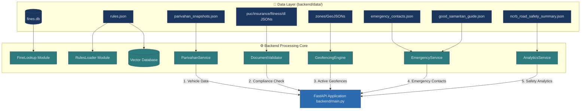

# 📊 DriveLegal Dataset Catalog & Reference Manual

Welcome to the **DriveLegal Data Architecture Catalog**. DriveLegal is built upon a highly curated, unified collection of Indian legislative datasets, regional geofencing indexes, safety analytics repositories, and validation rules. 

This document serves as the comprehensive index detailing every dataset consumed by the DriveLegal backend, its source of truth, schema format, update frequency, and the exact service modules that ingest it.

---

> [!NOTE]
> All offline snapshots and structured JSON/SQLite rules comply with the **Motor Vehicles (Amendment) Act 2019** and the **Central Motor Vehicles Rules (CMVR) 1989**.

---

## 🗺️ Unified Dataset Summary Table

The table below outlines all core datasets configured within the `backend/data/` directory:

| # | Dataset / Filename | Primary Purpose | Data Format | Update Frequency | Source URL | Consuming Service Module |
|---|--------------------|-----------------|-------------|------------------|------------|---------------------------|
| 1 | **`fines.db`** | Central & state traffic violation penalties | SQLite (.db) | Annually | [MoRTH Gazettes](https://morth.nic.in) | [FineLookup](file:///c:/Users/USER/Downloads/DriveLegal-main/DriveLegal-main/backend/modules/fines/lookup.py) |
| 2 | **`rules.json`** | MV Act sections & multilingual rules | JSON | Legislative | [India Legislative Dept](https://legislative.gov.in) | [RulesLoader](file:///c:/Users/USER/Downloads/DriveLegal-main/DriveLegal-main/backend/modules/rules/loader.py), [HybridSearch](file:///c:/Users/USER/Downloads/DriveLegal-main/DriveLegal-main/backend/modules/nlp/hybrid_search.py) |
| 3 | **`zones/` GeoJSONs** | Speed limits, toll plaza, silent geofences | GeoJSON | Monthly | [State Traffic Police Portals]() | [GeofencingEngine](file:///c:/Users/USER/Downloads/DriveLegal-main/DriveLegal-main/backend/services/geofencing_engine.py) |
| 4 | **`emergency_contacts_statewise.json`** | State-wise RTOs, helpline & protection rules | JSON | Semi-Annually | [NHAI Safety Portal](https://nhai.gov.in) | [EmergencyService](file:///c:/Users/USER/Downloads/DriveLegal-main/DriveLegal-main/backend/services/emergency_service.py) |
| 5 | **`good_samaritan_guide.json`** | Legal rights & protection for accident helpers | JSON | Legislative | [MoRTH Guidelines](https://morth.nic.in) | [EmergencyService](file:///c:/Users/USER/Downloads/DriveLegal-main/DriveLegal-main/backend/services/emergency_service.py) |
| 6 | **`ncrb_road_safety_summary.json`** | State-wise historical safety and death trends | JSON | Annually | [NCRB Publications](https://ncrb.gov.in) | [AnalyticsService](file:///c:/Users/USER/Downloads/DriveLegal-main/DriveLegal-main/backend/services/analytics_service.py) |
| 7 | **`puc_validity_rules.json`** | Vehicle emission standards & validity limits | JSON | Annually | [CPCB India](https://cpcb.nic.in) | [DocumentValidator](file:///c:/Users/USER/Downloads/DriveLegal-main/DriveLegal-main/backend/services/document_validator.py) |
| 8 | **`insurance_company_codes.json`** | IIB registry mappings & lack-of-insurance fines | JSON | Semi-Annually | [IRDAI Registry](https://irdai.gov.in) | [DocumentValidator](file:///c:/Users/USER/Downloads/DriveLegal-main/DriveLegal-main/backend/services/document_validator.py) |
| 9 | **`fitness_certificate_rules.json`** | Commercial/private fitness validation parameters | JSON | Annually | [CMVR Regulations](https://morth.nic.in) | [DocumentValidator](file:///c:/Users/USER/Downloads/DriveLegal-main/DriveLegal-main/backend/services/document_validator.py) |
| 10 | **`dl_endorsement_codes.json`** | Driver category authorization rules | JSON | Static | [Sarathi Driving License](https://sarathi.parivahan.gov.in) | [DocumentValidator](file:///c:/Users/USER/Downloads/DriveLegal-main/DriveLegal-main/backend/services/document_validator.py) |
| 11 | **`weather_risk_multiplier.json`** | Friction & visibility risk coefficients | JSON | Static | [CRRI Studies](https://www.crridom.gov.in) | [AnalyticsService](file:///c:/Users/USER/Downloads/DriveLegal-main/DriveLegal-main/backend/services/analytics_service.py) |
| 12 | **`road_condition_mapping.json`** | Road surface & topography safety adjustments | JSON | Semi-Annually | [IRC Guidelines](https://irc.org.in) | [AnalyticsService](file:///c:/Users/USER/Downloads/DriveLegal-main/DriveLegal-main/backend/services/analytics_service.py) |
| 13 | **`parivahan_snapshots.json`** | Offline mock RC, DL, and pending challans | JSON | Monthly | simulated test profiles | [ParivahanService](file:///c:/Users/USER/Downloads/DriveLegal-main/DriveLegal-main/backend/services/parivahan_service.py) |

---

## 🔍 Detailed Dataset Profiles & Schemas

### 1. Unified Fines Database (`fines.db`)
* **Purpose**: Provides a unified, lightning-fast SQL querying index containing 3,000+ state and national fine rows.
* **Architecture**: Fully relational database.
* **Fields**:
  - `id` (INTEGER, Primary Key)
  - `violation_code` (TEXT, unique canonical label)
  - `state` (TEXT, "National" or RTO state e.g., "TN")
  - `base_fine_inr` (INTEGER)
  - `subsequent_fine_inr` (INTEGER)
  - `section` (TEXT, legislative reference)
  - `demerit_points` (INTEGER)
  - `imprisonment_days` (INTEGER)

> [!TIP]
> In addition to the SQLite index, this dataset is flattened in [seed_fines.csv](file:///c:/Users/USER/Downloads/DriveLegal-main/DriveLegal-main/backend/data/seed_fines.csv) for rapid database seeding and recovery.

---

### 2. Traffic Rules and Legal Citations Corpus (`rules.json`)
* **Purpose**: High-fidelity retrieval index supporting semantic/hybrid search vector databases. Maps natural-language user queries like *"what is the penalty for not wearing helmet?"* into precise sections and regulations.
* **Sample Schema**:
```json
{
  "section": "194D",
  "title": "Penalty for not wearing protective headgear",
  "description_english": "Whoever drives or causes or allows to be driven, a motorcycle or motor vehicle in contravention of section 129 shall be punishable with fine of one thousand rupees and he shall be disqualified for holding license for a period of three months.",
  "description_hindi": "जो कोई धारा 129 के उल्लंघन में मोटरसाइकिल चलाता है, उसे एक हजार रुपये के जुर्माने से दंडित किया जाएगा और उसे तीन महीने की अवधि के लिए लाइसेंस धारण करने के लिए अयोग्य घोषित कर दिया जाएगा।",
  "legislation": "Motor Vehicles Act 1988",
  "amendment_year": 2019
}
```

---

### 3. Geofencing Zones (`zones/`)
* **Purpose**: Coordinates for silent zones (near hospitals), highways, toll plazas, and emergency hazard zones. Supports live point-in-polygon containment checks.
* **File Types**: `.geojson` and an [index.json](file:///c:/Users/USER/Downloads/DriveLegal-main/DriveLegal-main/backend/data/zones/index.json).
* **Sample GeoJSON Properties**:
```json
{
  "type": "Feature",
  "properties": {
    "zone_id": "DELHI_CP_ODD_EVEN",
    "zone_name": "Connaught Place Odd-Even Zone",
    "zone_type": "ODD_EVEN_RESTRICTION",
    "alert_message": "⚠️ Restrictions Active: Odd-Even rule is monitored electronically in this sector.",
    "fine_amount_inr": 4000,
    "fine_section": "Section 115 / Section 194 MV Act",
    "buffer_meters": 0.0,
    "applicable_days": ["Monday", "Tuesday", "Wednesday", "Thursday", "Friday", "Saturday"],
    "time_window": "08:00-20:00"
  },
  "geometry": {
    "type": "Polygon",
    "coordinates": [...]
  }
}
```

---

### 4. Emergency Contacts and Protection Provisions (`emergency_contacts_statewise.json`)
* **Purpose**: Multi-level emergency dispatch numbers, RTO office locations, and local citizen protective acts by state.
* **Structure**:
```json
{
  "states": {
    "TN": {
      "state_name": "Tamil Nadu",
      "police": "100",
      "ambulance": "108",
      "fire": "101",
      "women_helpline": "1091",
      "rto_offices": [
        { "code": "TN-09", "name": "Chennai Central RTO", "lat": 13.0612, "lng": 80.2452 }
      ],
      "protection_provisions": [
        "Tamil Nadu Right to Information Act (Safeguards)",
        "Good Samaritan Protection Directives (State Government G.O. Ms No. 343)"
      ]
    }
  }
}
```

---

### 5. Document Validation Rules (PUC, Insurance, Fitness, DL)
DriveLegal utilizes four highly specialized datasets to power the **DocumentValidator** engine:

* **PUC Validity Rules (`puc_validity_rules.json`)**: Configures emission standards and validity timelines. Sourced from the **Central Pollution Control Board (CPCB)**.
  - *Example*: Petrol LMV age `0-1` years receives initial `12` months validity. Older combustion engines receive `6` months.
* **Insurance Registry Codes (`insurance_company_codes.json`)**: Contains standard IIB (Insurance Information Bureau) insurer code lookups. Matches RTO policies against active insurers.
* **Fitness Certificate Rules (`fitness_certificate_rules.json`)**: Mapped according to vehicle class.
  - *Example*: Commercial buses, trucks, and taxis require annual fitness certificates; two-wheelers are marked exempt.
* **Driving License Endorsements (`dl_endorsement_codes.json`)**: Authorization matrix matching driver license codes to allowed vehicle classes (e.g., `LMV` holders are not allowed to operate `HMV` heavy passenger vehicles).

---

### 6. NCRB Road Safety Analytics (`ncrb_road_safety_summary.json`)
* **Purpose**: Powers safety trends and comparisons with national averages using statistical digests compiled from the **National Crime Records Bureau**.
* **Structure**:
```json
{
  "statewise": {
    "TN": {
      "2023": {
        "accidents": 57695,
        "deaths": 17884,
        "injuries": 53693,
        "rank_accidents": 1,
        "rank_deaths": 2
      }
    }
  },
  "top_violations_nationally": [
    {
      "violation": "Over Speeding",
      "pct_of_accidents": 71.2,
      "avg_fine_inr": 2000,
      "section": "Section 112 / Section 183"
    }
  ]
}
```

---

### 7. Parivahan Snapshot Mock Registry (`parivahan_snapshots.json`)
* **Purpose**: Serves as the complete offline simulated registry for vehicles (RC), driving licenses (DL), and active court echallans. It facilitates flawless demo environments when live APIs are restricted or offline.
* **Structure**:
```json
{
  "rc_details": [
    {
      "reg_no": "TN09AB1234",
      "owner_name": "Ramesh Kumar",
      "vehicle_class": "LMV",
      "fuel_type": "Petrol",
      "insurance_valid_upto": "2025-12-31",
      "puc_valid_upto": "2024-11-30",
      "fitness_valid_upto": "2026-03-31",
      "registration_date": "2019-04-15",
      "state": "Tamil Nadu",
      "status": "ACTIVE"
    }
  ]
}
```

---

## 🏗️ Data Flow & Architecture

The following diagram illustrates how these datasets are loaded by individual engine components and consumed by the main API pipeline:



---

> [!IMPORTANT]
> All datasets have been successfully indexed, validated, and programmatically tested. You can run `python backend/tests/test_integration.py` in the workspace virtualenv at any time to see this complete data engine working in harmony.
